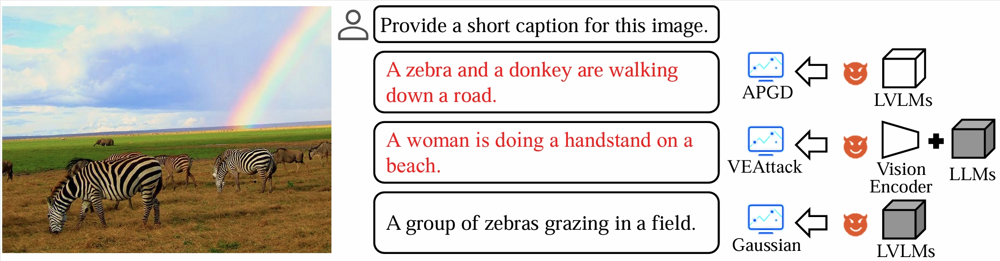

# VEAttack: Downstream-agnostic Vision Encoder Attack against Large Vision Language Models

arxiv: https://arxiv.org/abs/2505.17440

Hefei Mei, Zirui Wang, Shen You, Minjing Dong, Chang Xu



## Requirements

Our environment:

- CUDA=11.8
- Python=3.11

To install the required packages for white-box VEAttack, run:

```
pip install -r requirements.txt
```

To evaluate the transfer attack of VEAttack, you can follow the installation of [MiniGPT-4](https://github.com/Vision-CAIR/MiniGPT-4), [mPLUG-Owl2](https://github.com/X-PLUG/mPLUG-Owl/tree/main/mPLUG-Owl2) and [Qwen-VL](https://github.com/QwenLM/Qwen-VL/tree/master).

## White-box Attack

### Traditional APGD or Ensemble attack

```
# For LLaVA:
bash bash/llava_apgd.sh
bash bash/llava_ensemble.sh
# For OpenFlamingo:
bash bash/of_eval_9B_apgd.sh
```

### VEAttack on LLaVA

For captioning and VQA tasks, evaluation can be performed by modifying the -- eval_coco instruction in the args to eval_flicker30, eval_textvqa, and eval_vqav2.

```
# For LLaVA-7b:
bash bash/llava_7b_veattack_coco.sh
# For LLaVA-13b:
bash bash/llava_13b_veattack_coco.sh
# For OpenFlamingo:
bash bash/of_eval_9B_veattack.sh
```

For POPE tasks, it can be achieved by modifying the baseModel declaration 'LLAVA' or 'openFlamingo' in the shell file.

```
# For clean performance:
bash bash/eval_pope_clean.sh
# For VEAttack performance:
bash bash/eval_pope_veattack.sh
```

## Transfer Attack

You can download different adversarial training vision encoders from [RobustVLM](https://github.com/chs20/RobustVLM), and save them in ./ckpt of our project.

### mPLUG-Owl

- Prepare label file:
  
  ```
  python ./mPLUG-Owl/mPLUG-Owl2/data.py
  ```

- Evaluate VEAttack:
  
  ```
  bash ./mPLUG-Owl/caption_veattack.sh
  ```

### MiniGPT-4

```
bash ./MiniGPT-4/caption_veattack.sh
```

### Qwen-VL

After configuring the Qwen-VL environment, replace the file /home/.cache/huggingface/modules/transformers_modules/Qwen-VL/visual.py with the one in our project ./Qwen-VL/replace/visual.py. Then evaluate the performance of VEAttack:

```
bash ./Qwen-VL/caption_veattack.sh
```

## Acknowledgement

Our code is implemented based on [RobustVLM](https://github.com/chs20/RobustVLM), [LLaVA](https://github.com/haotian-liu/LLaVA), [OpenFlamingo](https://github.com/mlfoundations/open_flamingo), [MiniGPT-4](https://github.com/Vision-CAIR/MiniGPT-4), [mPLUG-Owl2](https://github.com/X-PLUG/mPLUG-Owl/tree/main/mPLUG-Owl2) and [Qwen-VL](https://github.com/QwenLM/Qwen-VL/tree/master). Thanks for their excellent works.